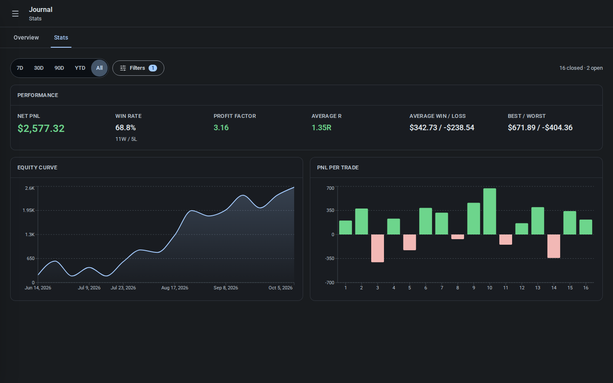
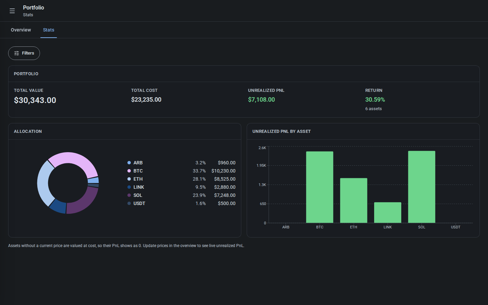
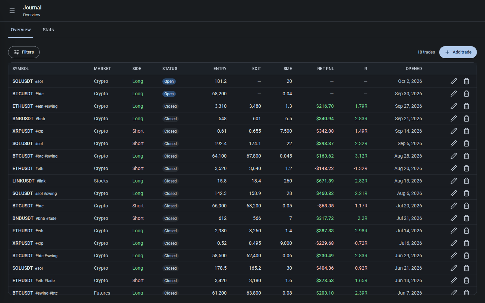
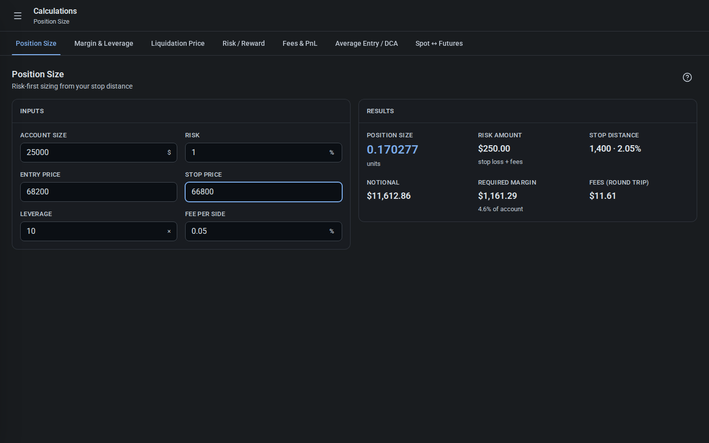
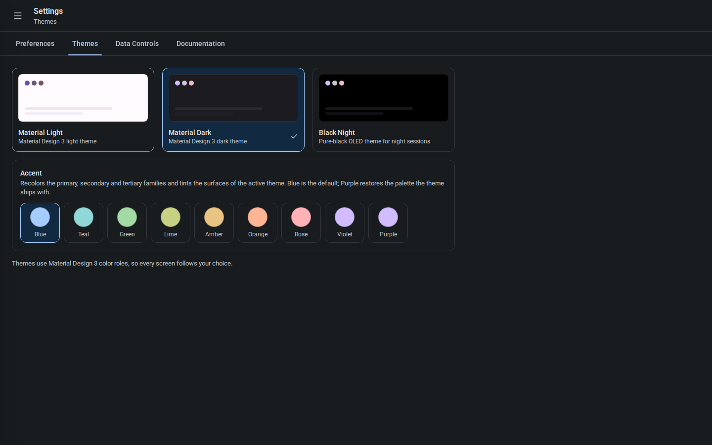

# ClyTrade

ClyTrade is a local-first trading app: a trade journal, a spot portfolio tracker
and a set of calculators. It ships as an installable PWA and as Windows and
Android wrappers built with Tauri v2. Everything runs on the device, with no
account, server or subscription.

> **Status:** early development. V1 covers the offline core and is usable for
> personal record-keeping, but expect rough edges and breaking changes before
> `1.0.0`.

## Why it exists

Small trading tools are scattered across paid apps, browser tabs and
spreadsheets, and several of the paid ones are simple calculators. ClyTrade puts
the journal, the portfolio and the calculators in one app that opens on the
calculator you need and computes as you type, and keeps the data in one local
database.

## What is in V1

| Area             | What it does                                                                                                                                                                                                                                                  |
| ---------------- | ------------------------------------------------------------------------------------------------------------------------------------------------------------------------------------------------------------------------------------------------------------- |
| **Journal**      | Track trades with derived net PnL, R multiples and per-trade stats. Filter from one Filters button — search, market, direction, status, tags, strategy, date and numeric ranges, outcome and field presence in a sheet — with an equity curve and PnL charts. |
| **Portfolio**    | Track holdings with blended cost basis, manual prices, unrealized PnL and allocation charts. Filter from one Filters button — search, market, quantity, cost, price, value, PnL, outcome and field presence.                                                  |
| **Calculations** | Seven calculators: Position Size, Margin & Leverage, Liquidation Price, Risk / Reward, Fees & PnL, Average Entry / DCA, Spot ↔ Futures.                                                                                                                       |
| **Settings**     | Default inputs, a default market for new entries, English and Persian interfaces (Persian runs right-to-left), three themes with accent palettes, data export/import/reset, sample data and the full documentation.                                           |

## Screenshots

Captured in the desktop layout with the sample data and the Dark theme,
at 1440×900.

| Journal stats                                                                            | Portfolio stats                                                                             |
| ---------------------------------------------------------------------------------------- | ------------------------------------------------------------------------------------------- |
|  |  |

| Journal overview                                                                                         | Position Size calculator                                                                |
| -------------------------------------------------------------------------------------------------------- | --------------------------------------------------------------------------------------- |
|  |  |



Regenerate them with `npm run screenshots`; run `npm run screenshots:install`
once first to fetch the Chromium build Playwright uses. The script starts Vite on
`127.0.0.1:5199` (`SCREENSHOTS_PORT` overrides), loads the sample data and
captures each page into `screenshots/desktop/`.

## Getting started

Requires Node 22.12 or newer and npm.

```bash
npm install
npm run dev        # Vite dev server on http://localhost:5173
npm run dev:lan    # dev server on http://0.0.0.0:7401 (strict; PORT overrides)
./scripts/live.sh  # same server in the background (LIVE_SERVER_PORT overrides)
```

`npm run dev:lan` and `./scripts/live.sh` bind `0.0.0.0:7401` so the app can be
opened from a phone or another device on the same network. `live.sh` writes its
output to `/tmp/clytrade-liveserver.log` and its pid to
`/tmp/clytrade-liveserver.pid`; stop it with
`kill $(cat /tmp/clytrade-liveserver.pid)`.

To test installability and offline mode, run `npm run build && npm run preview`.
The service worker is disabled in the dev server.

Other commands:

| Command                            | Purpose                                                                       |
| ---------------------------------- | ----------------------------------------------------------------------------- |
| `npm run build`                    | Typecheck, production build and PWA service worker                            |
| `npm run preview`                  | Serve the production build                                                    |
| `npm test`                         | Vitest run (jsdom, fake-indexeddb)                                            |
| `npm run typecheck`                | `tsc -b` across the app and node configs                                      |
| `npm run lint`                     | ESLint (flat config)                                                          |
| `npm run format`                   | Prettier write                                                                |
| `npm run icons`                    | Regenerate PWA icons into `public/icons/`                                     |
| `npm run icons:native`             | Regenerate Tauri and Android icons from `public/icons/icon-512.png`           |
| `npm run accents`                  | Regenerate the accent palettes into `src/theme/accents.css`                   |
| `npm run a11y`                     | Local axe audit: key pages × 3 themes × desktop and mobile (serious/critical) |
| `npm run screenshots`              | Capture desktop screenshots into `screenshots/desktop/`                       |
| `npm run screenshots:install`      | Fetch the Chromium build Playwright needs                                     |
| `npm run tauri:build`              | Windows desktop build (needs Windows and Rust)                                |
| `npm run android:apk`              | Android release APK (needs JDK 17, Android SDK/NDK and Rust)                  |
| `npm run version:set -- <version>` | Bump the version in `package.json`, both lockfiles and `src-tauri/Cargo.toml` |

### Platforms and native builds

The Windows and Android wrappers are Tauri v2 projects in `src-tauri/` and reuse
the same frontend build. `npm run build` always produces the PWA; when Tauri runs
the build it sets `TAURI_ENV_PLATFORM`, which disables the service worker for the
native bundle. The PWA remains the reference platform.

`.github/workflows/release.yml` produces the artifacts for both platforms. Run
the workflow from the Actions tab to download test builds, or push a `v*` tag to
get a draft GitHub Release. The builds are not code-signed. Artifact names are:

| Platform            | Artifact                                   |
| ------------------- | ------------------------------------------ |
| Windows (portable)  | `ClyTrade-<version>-windows-x64.exe`       |
| Windows (installer) | `ClyTrade-<version>-windows-x64-setup.exe` |
| Android             | `ClyTrade-<version>-android-universal.apk` |

### Install on iPhone and iPad

The PWA is deployed to GitHub Pages by `.github/workflows/pages.yml` on every
`v*` tag, or manually from the Actions tab. One-time setup is **Settings → Pages
→ Source: GitHub Actions**. To verify the Pages base locally:

```bash
VITE_BASE=/ClyTrade/ npm run build
VITE_BASE=/ClyTrade/ npm run preview
```

To install on iPhone or iPad, open <https://benyamin-git.github.io/ClyTrade/> in
Safari (Home Screen installs are Safari-only), tap **Share**, then **Add to Home
Screen**. The installed app runs standalone and offline and picks up a new
deployment the next time it opens online.

## Data and storage

All data is stored in IndexedDB, in a database named `clytrade`, through Dexie.
Nothing is sent anywhere. The interface language, the accent and an explicit
theme choice are kept in `localStorage` and applied before the first paint;
until you pick a theme, the app follows the system light or dark setting.

Settings → Data Controls **Export backup** writes a single JSON file containing
the journal, portfolio and settings (including the interface language and default
market). **Import** offers a merge or a replace, and validates the file before
writing. The theme and accent are not part of the backup.

Trades and holdings each carry a market (Crypto, Forex, Stocks, Futures,
Commodities, Indices, Bonds, Options or Unspecified). In Overview and Stats, both
the Journal and Portfolio open their filters from a single **Filters** button,
whose badge counts the active filter groups. The sheet holds every control:
search and market, plus feature-specific fields — the Journal by direction,
status, tags, strategy, dates, price and size, performance, outcome and presence;
the Portfolio by quantity, cost, price, value, PnL, outcome and presence. Sheet
sections start collapsed and auto-open when a section holds an active filter. New
entries start on the default market from Preferences, and filters are page-local
and reset when you leave the page. Records made before markets existed are
Unspecified. Backups are schema version 2; version 1 files still import.

## Project layout

| Path                | Contents                                                                              |
| ------------------- | ------------------------------------------------------------------------------------- |
| `src/app/`          | App shell: router, providers, top bar, navigation drawer, subtab bar                  |
| `src/features/`     | Feature UI and application logic (`journal`, `portfolio`, `calculations`, `settings`) |
| `src/calculations/` | Pure, tested math layer — the protected core of the app                               |
| `src/data/`         | Dexie schema, zod models, repositories, backup and restore                            |
| `src/ui/`           | Design-system primitives and layout components                                        |
| `src/theme/`        | MD3 design tokens and the three themes                                                |
| `src/i18n/`         | Typed English and Persian dictionaries, locale detection and the locale provider      |
| `src/docs/`         | Markdown documentation rendered inside the app                                        |
| `src-tauri/`        | Tauri v2 shell for the Windows and Android builds (Rust and the Android project)      |
| `masterplan.md`     | Product direction and design decisions                                                |

## Documentation

The full user documentation is inside the app under **Settings →
Documentation**, with its source in `src/docs/**` — complete in English and
Persian. Product direction, scope and the reasoning behind the major decisions
live in [`masterplan.md`](./masterplan.md).
User-facing text is in typed dictionaries in `src/i18n/`, in English and Persian
(Persian runs right-to-left).

## Releases and versioning

ClyTrade follows [Semantic Versioning](https://semver.org): `MAJOR.MINOR.PATCH`.
Until `1.0.0`, breaking changes may land in minor releases, and every `0.x` tag
is published as a GitHub pre-release. Changelog entries live in
[`CHANGELOG.md`](./CHANGELOG.md).

`npm run version:set -- <version>` updates the version in `package.json`, both
lockfiles and `src-tauri/Cargo.toml`. Pushing a `v<version>` tag builds both
platforms, opens a draft GitHub Release and deploys the PWA to GitHub Pages.

## Roadmap

V1 covers the offline core. Planned work:

- Optional live market data integrations (opt-in)
- Optional synchronization between devices
- More languages and translations
- More calculators and statistics, and import from exchange CSV files

Open ideas and known bugs are tracked in [`TODO.md`](./TODO.md).

## Limitations and non-goals

- Not financial advice. ClyTrade is a calculator and record-keeping tool; it does
  not execute trades, connect to an exchange, or recommend what to buy or sell.
- Calculations are estimates based on the inputs and the assumptions documented
  in the in-app documentation. Exchange formulas, fees and funding rates can
  differ, so verify numbers against your exchange before acting on them.
- The native builds are unsigned test builds. Windows SmartScreen warns about the
  unknown publisher on first run.
- Android in-place updates fail because each CI build is signed with a fresh
  keystore. Uninstalling first is the only workaround, and it wipes the local
  data, so export a backup before updating.
- Each install has its own storage sandbox, so the browser PWA, the Windows build
  and the Android build do not share data. Move data with export and import.
- There is no cloud sync or account in V1.

## AI-assisted development

ClyTrade is written almost entirely by AI. The maintainer directs the work, makes
the product decisions, reviews every change and runs the tests; the code and
documentation are AI-generated. The same statement, with more detail, is
included in the app under **Settings → Documentation → AI Usage**.

## License

Copyright (C) 2026 benyamin-git. ClyTrade is free software, licensed under the
**GNU General Public License v3.0**; see [`LICENSE`](./LICENSE) for the full
text. It is distributed without any warranty, without even the implied warranty
of merchantability or fitness for a particular purpose.
